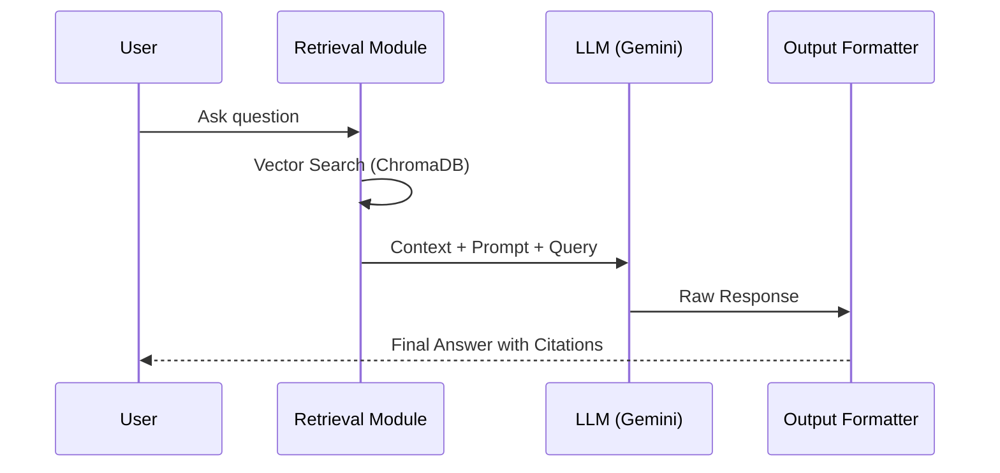

# Architecture Design: Modular RAG Chatbot for NextLeap

This document outlines the technical architecture for a modular Retrieval-Augmented Generation (RAG) chatbot designed to answer queries based on the [NextLeap Product Management Course](https://nextleap.app/course/product-management-course).

## 1. High-Level System Architecture

The system follows a modular pipeline architecture, separating data acquisition, indexing, retrieval, and generation into discrete components.

```ascii
+-----------------+       +-----------------------+       +-------------------+
|  Phase 1:       | ----> |  Phase 2:             | ----> |  Phase 3:         |
|  Web Scraper    | JSON  |  Embedding & Storage  | Index |  Retrieval        |
|  (Course Page)  |       |  (Vector Database)    |       |  (Context Search) |
+-----------------+       +-----------------------+       +---------+---------+
                                                                    |
                                                                    v Context
+-------------------------+       +-----------------------+       +---------+---------+
|  User Interface / API   | <---- |  Phase 5:             | <---- |  Phase 4:         |
|  (Entry Point)          | Reply |  Response Generation  | Prompt|  LLM Integration  |
+-------------------------+       +-----------------------+       +-------------------+
```

---

## 2. Phase 1: Web Scraper Module

Responsible for extracting high-fidelity structured data from the NextLeap course page.

### Scraping Approach
- **Strategy**: Hybrid approach. Use `requests` + `BeautifulSoup` for static SEO-friendly content. Use `Playwright` if the curriculum or testimonials are loaded via client-side hydration.
- **Tools**: Python, `BeautifulSoup4`, `Playwright` (Chromium).
- **Rate Limiting**: Implementation of a 1-second delay between requests; custom User-Agent header to identify the bot.

### Content Extraction & Normalization
- **Navigation**: Scrape the main landing page and follow links to "Reviews" or "Syllabus" sub-sections if they reside on separate internal URLs.
- **Targets**:
    - Course Title & Overview
    - Modules & Weekly breakdown (from the curriculum section)
    - Instructors & Mentor profiles
    - Testimonials & Success Stories
    - Pricing & FAQs
- **Cleaning**: Removal of HTML tags, script blocks, and whitespace normalization.

### Data Schema (Output)
```json
{
  "source": "https://nextleap.app/course/product-management-course",
  "scraped_at": "ISO-8601-Timestamp",
  "sections": [
    {
      "id": "curriculum_week_1",
      "heading": "Week 1: Mapping Business Outcomes",
      "content": "Full text of week 1 curriculum...",
      "metadata": { "type": "curriculum", "week": 1 }
    }
  ]
}
```

---

## 3. Phase 2: Embedding & Vector Storage Module

Converts the JSON dataset into searchable mathematical vectors.

### Data Processing
- **Chunking**: Recursive Character Splitting with a chunk size of 800 tokens and 15% overlap. This ensures context is preserved across split boundaries.
- **Embedding Model**: `text-embedding-004` (Google) via Vertex AI/AI Studio for high-dimensional semantic representation.

### Vector Storage
- **Recommendation**: **ChromaDB** (Local/Modular) or **Pinecone** (SaaS).
- **Metadata Handling**: Store `source_url`, `section_type`, and `heading` alongside vectors to enable filtered searches and citations.

---

## 4. Phase 3: Retrieval Module

Orchestrates the selection of relevant context for a user query.

### Retrieval Pipeline
1. **Query Preprocessing**: Clean user text (lowercase, remove noise).
2. **Embedding**: Convert user query into a vector using the same model as Phase 2.
3. **Search**: K-Nearest Neighbors (k-NN) or Cosine Similarity search.
4. **Reranking (Optional)**: Use a Cross-Encoder model (e.g., `BGE-Reranker`) to re-order the top-10 results for better precision.

### Guardrails
- **Relevance Threshold**: Ignore results with a similarity score below 0.7.
- **Query Validation**: Sanitize input to prevent prompt injection or irrelevant system queries.

---

## 5. Phase 4: LLM Integration Module

The "brain" of the chatbot, responsible for understanding context and formulating answers.

### Model Configuration
- **Provider**: Google AI Studio (Gemini 1.5 Flash or Pro).
- **Security**: API keys stored in `.env` files; never hardcoded or committed to VCS.
- **Prompt Architecture**:
    - **System Prompt**: Defines persona (Helpful NextLeap Admission Assistant), constraints, and formatting rules.
    - **Context Injection**: `{context_blocks}` passed as a structured list of snippets.

---

## 6. Phase 5: Response Generation Pipeline

The final assembly of retrieved data and LLM intelligence.

### Data Flow Diagram


### Citation & Hallucination Strategy
- **Grounding**: The system prompt strictly forbids answering outside the provided context. If no info is found, return "I'm sorry, I don't have information on that specific detail of the course."
- **Citation Format**: "Based on the [Curriculum] section, week 1 covers..."

---

## 7. Project Structure

```text
nextleap-rag-chatbot/
├── data/
│   ├── raw/                # Original JSON from scraper
│   └── processed/          # Cleaned/Chunked data
├── modules/
│   ├── scraper/            # Phase 1: Scrapy/Playwright logic
│   ├── embedder/           # Phase 2: Embedding & Indexing
│   ├── retriever/          # Phase 3: Search & Reranking
│   ├── generator/          # Phase 4 & 5: Gemini Integration
│   └── utils/              # Logging, Config, Helpers
├── vector_db/              # Local storage for ChromaDB
├── .env.example            # Template for GOOGLE_API_KEY
├── architecture.md         # This document
└── requirements.txt
```

---

## 8. Technology Stack

| Component | Technology |
| :--- | :--- |
| Framework | Python 3.10+ |
| LLM | Google Gemini 1.5 |
| Vector DB | ChromaDB |
| Embeddings | Google `text-embedding-004` |
| Scraping | Playwright / BeautifulSoup4 |
| Orchestration | LangChain or LlamaIndex |

---

## 9. Design Considerations

- **Scalability**: Decoupled modules allow swapping ChromaDB for Pinecone without changing the LLM logic.
- **Modularity**: Each phase exposes a clear API/Function interface (e.g., `retriever.get_context(query)`).
- **Security**: Ensure environment variables are used for all secrets.
